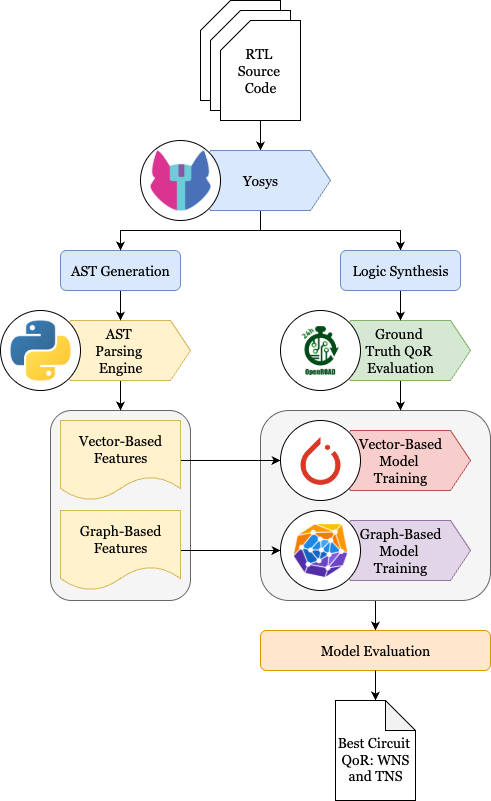

# EEL6812 Group Project

```
  ░██████              ░█████████  ░███    ░██               ░██    
 ░██   ░██             ░██     ░██ ░████   ░██               ░██    
░██     ░██  ░███████  ░██     ░██ ░██░██  ░██  ░███████  ░████████ 
░██     ░██ ░██    ░██ ░█████████  ░██ ░██ ░██ ░██    ░██    ░██    
░██     ░██ ░██    ░██ ░██   ░██   ░██  ░██░██ ░█████████    ░██    
 ░██   ░██  ░██    ░██ ░██    ░██  ░██   ░████ ░██           ░██    
  ░██████    ░███████  ░██     ░██ ░██    ░███  ░███████      ░████ 
       ░██                                                          
        ░██                                                                                                             
```

## Team Members
- Cory Brynds, MS CpE
- DeAndre Hendrix, MS CpE
- Youssef Samwell, MS EE
- Pablo Rodriguez, MS CpE

## Overview

This project was completed for the Spring 2026 course *EEL6812: Intro to Neural Networks and Deep Learning*. The project aims to predict post-implementation circuit delay from pre-synthesis RTL code.



## Directory Structure

- `ast-parser/`: Feature extraction scripts used to turn RTL into PyTorch tensors
- `models/`: Main QoRNet training and evaluation code for linear regression, MLP, and GNN models
- `eda-pipeline/`: Scripts and data for the EDA pipeline used to produce ground truth metrics
- `resources/`: Reference papers and project materials used for methodology comparison
- `data/`: Ground truth CSVs, graph tensors, and training configuration files

## External Submodules

- [HDL Benchmarks](https://github.com/ispras/hdl-benchmarks.git): Collection of open-source RTL benchmarks used for training data
- [Open-EDA-Flow](https://github.com/cbrynds/Open-EDA-Flow.git): Containerized Yosys/OpenROAD flow support, developed by Cory for a past course project

Run

```
git submodule init
git submodule update
```

## Dependencies

### Python

Install the Python packages listed in `requirements.txt`:

```bash
python3 -m pip install -r requirements.txt
```

### EDA Tooling

The framework also relies on external EDA tools:
- `Yosys`
- `OpenROAD`

These tools can be accessed through an Apptainer image in the `Open-EDA-Flow` git submodule. See usage instructions under `Open-EDA-Flow/README.md`. 

**Note**: the Apptainer `.sif` file can be quite large after it is built, nearly 15GB in size.

## Usage

### 1. EDA Pipeline
Collect the ground truth data and ASTs for model training. Exact instructions are included under `eda-pipeline`.

**FYI: Must be from Stokes or another slurm environment with Apptainer installed**

```bash
source eda-pipeline/slurm_scripts/slurm_setup.sh
./eda-pipeline/slurm_scripts/slurm_submit_array.sh eda-pipeline/pipeline_test.yaml
```

After all runs have finished:

```bash
./eda-pipeline/slurm_scripts/slurm_merge_results.sh eda-pipeline/pipeline_test.yaml
```

This runs a couple of designs through the EDA pipeline, merges the sharded results together, and produces the ground truth results at `eda-pipeline/test_results/test_ground_truth_qor.csv`. The full training CSV can be found under `data`. Yosys-generated ASTs have been pre-saved under `data/yosys_asts`.

### 2. AST Parsing
Convert Yosys ASTs generated by EDA pipeline into vector- and graph-based PyTorch feature tensors.

```bash
python3 ast-parser/ast_vector_parse.py -src_dir data/yosys_asts -out_dir data/qornet_graphs
```

### 3. Model Training
Train models. Detailed instructions are included in each model directory under `models`. For an example training flow for the GNN, run

```bash
python3 models/GNN/qornet.py --target_name "wns" \
--config data/qornet_design_config.yaml \
--labels data/ground_truth_data/iscas_ground_truth_qor.csv \
--dataset_dir data/graph_dataset/tensors/ \
--plot_dir qornet_gnn_results_wns \
--checkpoint_path qornet_gnn_results_wns/qornet_checkpoint.pt \
--cv_folds 5 --cv_fold_index 0 --cv_stratify_by_size \
--disable_verbose \
```

This will output diagnostic information and training results to a folder called `qornet_gnn_results_wns`. From there, pre-trained model weights will be saved. Evaluation can now be carried out on a per-design basis.

```bash
python3 models/GNN/qornet.py --mode inference --checkpoint_path data/qornet_checkpoint.pt --single_graph data/graph_dataset/tensors/s349.pt
```

This command evaluates the `s349` design from the ISCAS '89 benchmark using the pre-trained model from CV fold 0. It will print out the predicted WNS along with the time taken to evaluate the model.
